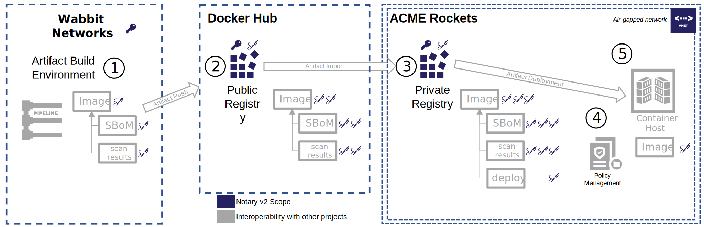

We are happy to announce the [alpha 1 release][notation-release] of the [Notary v2 project][notary-v2].
Notary v2 enables signing of all artifacts (Container Images, Software Bill of Materials, Scan Results) stored in an [OCI Distribution][oci-distribution] based registries, with [oras artifacts spec][oras-artifacts] enhancements.
A key tenant of Notary v2 is that it enables promotion of signed artifacts within and across registries, including air-gapped and private network environments.

In addition to signature promotion, Notary v2 focuses on ease of use, with minimal dependencies. While Notary v2 can integrate with other supply chain efforts, there are no additional services required to sign or validate an artifact.
As artifacts get promoted, users/entities may add new signatures, attesting to the validity of the content for the target environment, enabling a secure supply chain workflow.

Through signing, users choose the artifacts they trust, from the entities they trust, [decoupling location from identity](https://stevelasker.blog/2021/09/24/separating-identity-from-location/).

## Features

The [Notation alpha 1 release][notation-release] supports the following [Notary v2 goals][notary-v2-goals]:
- Offline signature creation
- Signatures attesting to authenticity and/or certification
- Maintain the original artifact digest and collection of associated tags, supporting existing dev through deployment workflows
- Multiple signatures per artifact, enabling the originating vendor signature, public registry certification and user/environment signatures
- Signature persistance within an [OCI Artifact][oci-artifacts] enabled, [distribution-spec][oci-distribution] based registry, with [oras artifacts spec][oras-artifacts] enhancements
- Air-gapped environments, where the originating registry of content is not accessible
- Artifact and signature copying within and across [OCI Artifact][oci-artifacts] enabled, [distribution-spec][distribution-spec] based registries
- Verification of signatures, through a configuration based policy

Future versions of Notary v2 will support:

- Key hierarchies and delegation
- Key revocation, including private and air-gapped registries
- Verification through policy, enabling environment specific validations
- OCI Distribution 1.0 support

## Getting Started

- [Notation CLI Alpha 1 release][notation-release]
- [Notation Quick Start](https://github.com/notaryproject/notation#notation-quick-start)
- [Join the notary v2 community](https://github.com/notaryproject/notation#community)

[notary-v2]:              https://github.com/notaryproject/notaryproject/
[notary-v2-goals]:        https://github.com/notaryproject/notaryproject/blob/main/requirements.md#goals
[notation-release]:       https://github.com/notaryproject/notation/releases/tag/v0.7.0-alpha.1
[oci-distribution]:       https://github.com/opencontainers/distribution-spec
[oci-artifacts]:          https://github.com/opencontainers/artifacts
[oras-artifacts]:         https://github.com/oras-project/artifacts-spec/

